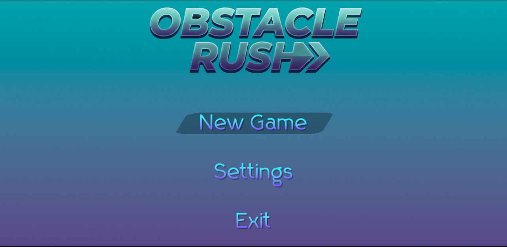
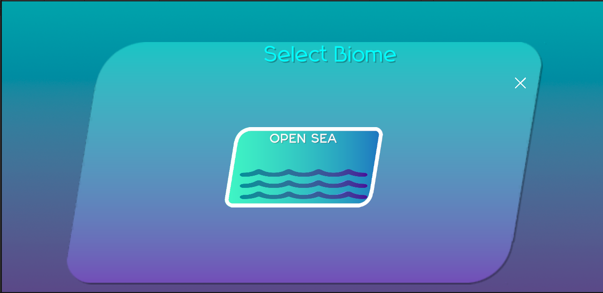
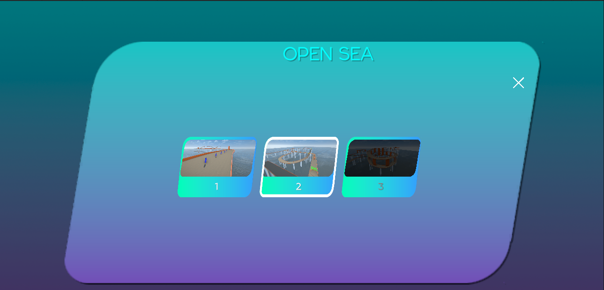
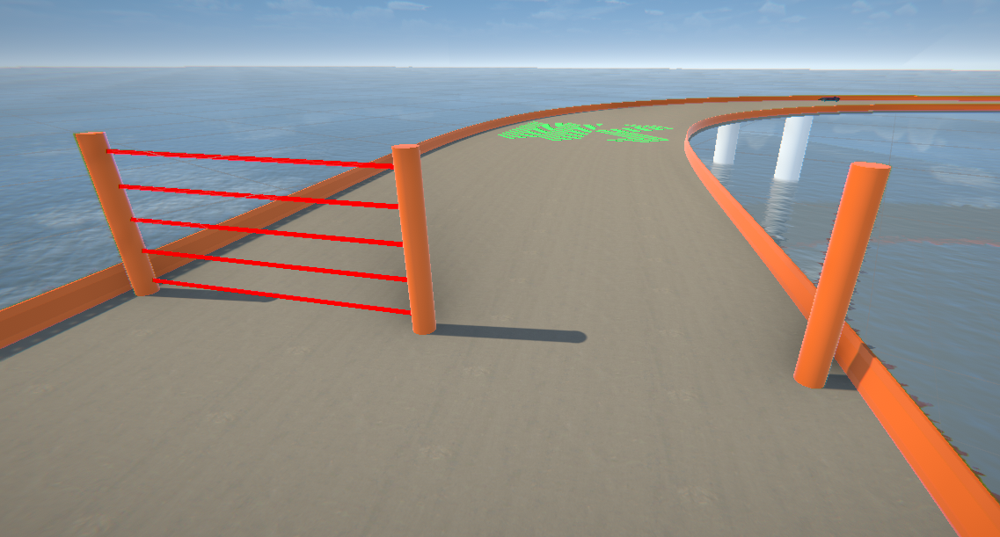
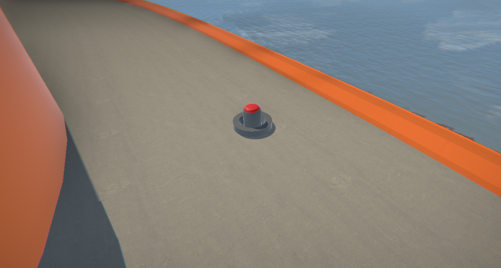
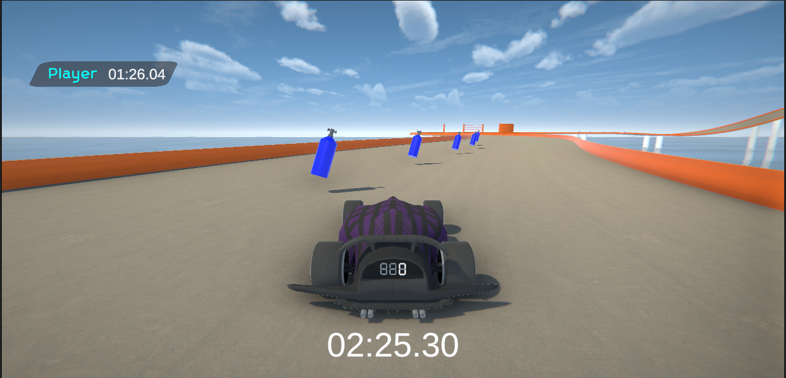
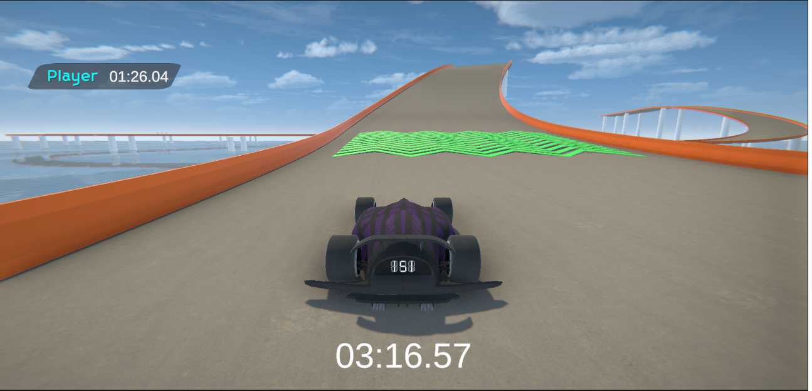

# Obstacle Rush Prototype

**Obstacle Rush** — 3D-гонка на время, где игроку предстоит преодолевать препятствия, объезжать ловушки и использовать ускорения для установки новых рекордов трассы.

---

##  Игровой режим
*  **На время**: Главная цель — пройти трассу за минимальное время. Установка лучшего результата открывает доступ к следующим трекам.

<table>
  <tr>
    <td width="50%">
      
    </td>
    <td width="50%">
      
    </td>
  </tr>
</table>

##  Ловушки и Препятствия
*  **Stun Mine (Оглушающая мина)**: При наезде полностью блокирует управление автомобилем на заданное время.
*  **Laser Gate (Лазерные ворота)**: Ворота с периодически включающимися лазерами. Проезд через активный лазер сжигает заряд нитро и временно отключает управление.
*  **Hack Zone (Взлом-панель)**: Напольная ловушка, которая на короткий промежуток времени инвертирует управление автомобилем (лево меняется с правым).

<table>
  <tr>
    <td width="50%">
      
    </td>
    <td width="50%">
      
    </td>
  </tr>
</table>

##  Бонусы и Ускорители
*  **Платформа-ускоритель (Boost Pad)**: Напольная панель, придающая автомобилю мгновенный физический импульс вперед.
*  **Заряд Нитро (Nitro Charge)**: Подбираемая сущность, дающая заряд ускорения для ручного использования игроком в нужный момент.

<table>
  <tr>
    <td width="50%">
      
    </td>
    <td width="50%">
      
    </td>
  </tr>
</table>

---

##  Техническая реализация

Проект спроектирован с упором на чистую архитектуру и масштабируемость:
* **Архитектура MVC**: Префабы сущностей (ловушки, бонусы) построены на базе паттерна **Model-View-Controller**
* **Scriptable Objects**: Характеристики всех интерактивных объектов (скорость, длительность эффекта оглушения, сила импульса, количество зарядов) вынесены в `Scriptable Objects`. 
* **Физика машины**: Построена с использованием компонента `Wheel Collider`
* **Пользовательский интерфейс**: Реализован с помощью `TextMeshPro` для четкого отображения при любом разрешении экрана.

##  Технологии
* **Движок**: Unity
* **Язык**: C#
* **3D Моделирование**: Blender

##  Управление
* **W, A, S, D / Стрелки** — Газ, тормоз, повороты.
* **R** — Респавн на последней пройденной контрольной точке.
* **Space** — Ручной тормоз.
* **Shift** — Использование заряда Нитро.
